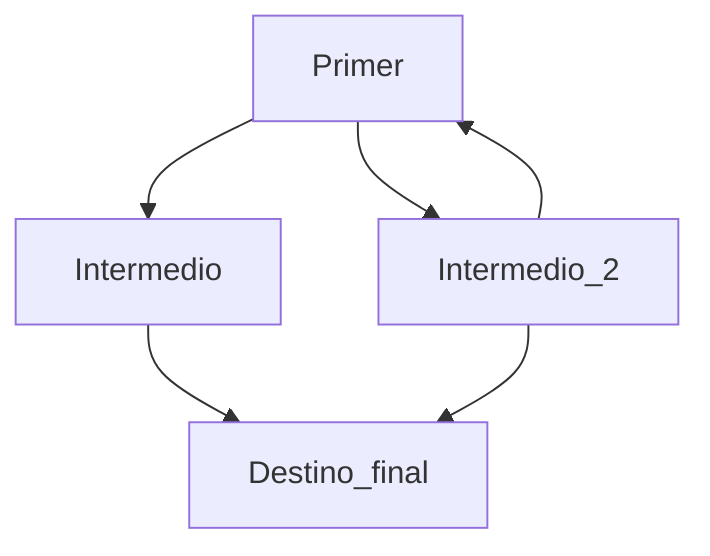

# Este es el titulo del mi README

> [!WARNING]
> Informo que hice cambios desde mi ordenador personal donde tengo git configurado con mi cuenta personal por eso aparece mi cuenta personal de Github como contribuidor 

> [!IMPORTANT]
> Es importante saber que esto es un ejemplo.

> [!NOTE]
> Tener en cuenta esto son ejemplos 

Aqui **expondre** una *lista* de cosas, un enlace y un diagrama sencillo como prueba

¿Que color es? `#fab387`

Esta es una lista de cosas

- Balon
- Pantalla
- [ ] Tarea por hacer para el desarrollo de la nueva funcionalidad
- [X] Tarea hecha

[El usuario que creo este README](https://github.com/Mestosc)

Pasos:
1. Crear repositorio local
2. Crear repositorio en Github
3. Usar comando para conectarlo al respositorio en linea
   - El comando es `git remote add origin https://github.com/Primer_Readme.git`
4. Tambien use el comando `git branch -M main` para cambiar el nombre de la rama en el repositorio local de `master` a `main`	
5. Hacer `git add NombreArchivo`
6. Hacer `git commit -m "Primer commit"`
7. Hacer `git push -u origin main`
8. Ya esta ahi el codigo 

