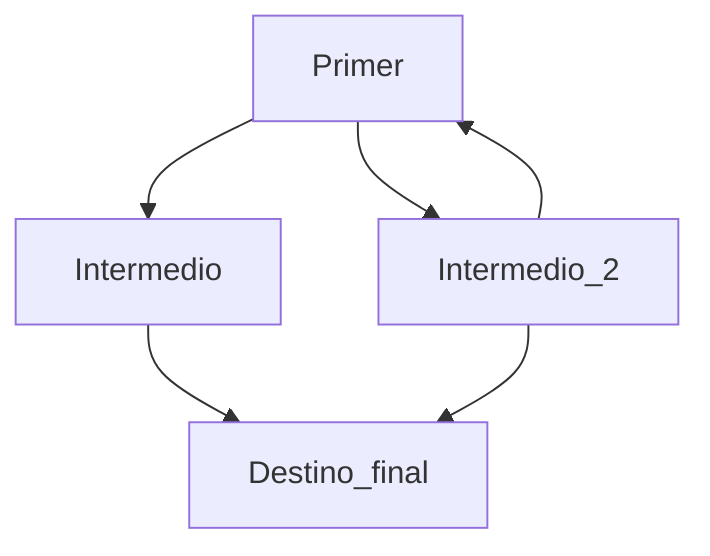

# Este es el titulo del mi README

> [!IMPORTANT]
> Es importante saber que esto es un ejemplo.

> [!NOTE]
> Tener en cuenta esto son ejemplos 

Aqui **expondre** una *lista* de cosas, un enlace y un diagrama sencillo como prueba

Esta es una lista de cosas

- Balon
- Pantalla
- [ ] Tarea por hacer para el desarrollo de la nueva funcionalidad
- [X] Tarea hecha
[El usuario que creo este README](https://github.com/Mestosc)

