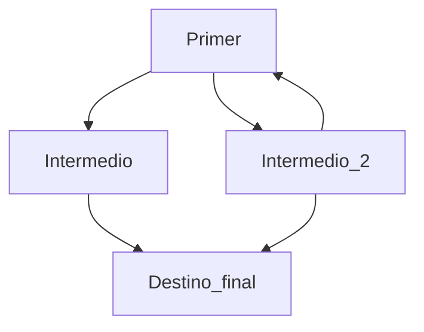

# Este es el título del mi README

> [!WARNING]
> Informo que hice cambios desde mi ordenador personal donde tengo git configurado con mi cuenta personal por eso aparece mi cuenta personal de Github como contribuidor 

> [!IMPORTANT]
> Es importante saber que esto es un ejemplo.

> [!NOTE]
> Tener en cuenta esto son ejemplos 

Aquí **expondré** una *lista* de cosas, un enlace, un diagrama sencillo y no se si más como prueba

Esta es una lista de cosas

- Balon
- Pantalla
- [ ] Tarea por hacer para el desarrollo de la nueva funcionalidad
- [X] Tarea hecha

[El usuario que creo este README](https://github.com/Mestosc)


Pasos:
1. Crear repositorio local
2. Crear repositorio en Github
3. Usar comando para conectarlo al respositorio en línea
   - El comando es `git remote add origin https://github.com/Primer_Readme.git`
4. También usé el comando `git branch -M main` para cambiar el nombre de la rama en el repositorio local de `master` a `main`	
5. Hacer `git add NombreArchivo`
6. Hacer `git commit -m "Primer commit"`
7. Hacer `git push -u origin main`
8. Ya esta ahi el codigo :heavy_check_mark:
 


## Codigo explicado
Este codigo muestra texto por salida estandar y hace un salto de línea de forma automatica

```java
System.out.println("Este es mi codigo");
```

Este codigo es para declarar e inicializar una variable

```java
int x = 23;
```

Esto es un codigo en python para hacer la broma más rara que he visto

```python
x = input("¿Desea usted destruirlo todo? ")
if x == "Si":
   print("Adioooos")
elif x == "si":
   print("Adioooos")
elif x == "SI":
   print("Adioooos")
else:
   print("Imet")

```
Condicional **if** en Java:
```java
int x = 23;

if (x >=23) {
    System.out.println("Estas en una edad interesante");
}
else {
    if (x <= 23)  {
     System.out.println("Esto es un ejemplo tampoco hay que ser lo más preciso" + x);   
    }
}
```


## Cita al azar

> En todo hay una parte de todo
> 
> Anaxágoras
